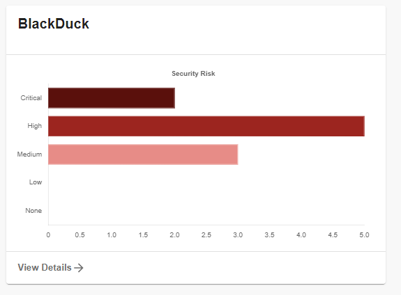

# blackduck

Welcome to the blackduck plugin!


## Getting started

#### Overview Page - BlackDuck Vulnerability Chart


#### Service Entiry Page - BlackDuck Vulnerability Table List


The following sections will help you get the BlackDuck plugin setup and running

### BlackDuck Backend
You need to setup the [BlackDuck backend plugin](https://github.com/deepan10/backstage-plugin-blackduck-backend) before you move forward with any of these steps if you haven't already

## Installation
This plugin needs to be added to an existing backstage instance.

```bash
# From your Backstage root directory
yarn add --cwd packages/app @deepan10/backstage-plugin-blackduck
```

`Note: You have 2 Options, you can setup both too`

### Option 1
Add BlackDuck Vulnerability chart in to Overview page

Import the plugin to `packages/app/src/components/catalog/EntityPage.tsx`.
### EntityPage.tsx
```typescript
// ...
import { BlackduckCard } from '@deepan10/backstage-plugin-blackduck';
// ...
const overviewContent = (
    <Grid container spacing={3} alignItems="stretch">
    {entityWarningContent}
    <Grid item md={6}>
      <EntityAboutCard variant="gridItem" />
    </Grid>
    //...
    <Grid item md={4} xs={12}>
      <BlackduckCard />
    </Grid>
    <Grid item md={8} xs={12}>
      <EntityHasSubcomponentsCard variant="gridItem" />
    </Grid>    
  </Grid>
);
```

### Option 2
Add BlackDuck Vulnerability Table List in to Service Entity

Import the plugin to `packages/app/src/components/catalog/EntityPage.tsx` and add the following.

### EntityPage.tsx
```typescript
// ...
import { BlackduckPage } from '@deepan10/backstage-plugin-blackduck';
// ...
const serviceEntityPage = (
    <EntityLayout>
    <EntityLayout.Route path="/" title="Overview">
      {overviewContent}
    </EntityLayout.Route>

    <EntityLayout.Route path="/ci-cd" title="CI/CD">
      {cicdContent}
    </EntityLayout.Route>
    //...
    <EntityLayout.Route path="/blackduck" title="Security">      
        <BlackduckPage />    
    </EntityLayout.Route>
    // ...    
  </EntityLayout>
);
```
`Note: If you dont want to display the Service page if no annotation specified in catalog.`
```typescript
//...
import { BlackduckPage, isBlackDuckAvailable } from '@deepan10/backstage-plugin-blackduck';
//...
<EntityLayout.Route if={isBlackDuckAvailable} path="/blackduck" title="Security">      
    <BlackduckPage />    
</EntityLayout.Route>
// ...    

```
## Configuration

Add the following into your `app-config.yaml`
### Config
```yaml
blackduck:
  host: https://blackduck.yourcompany.com/api
  token: YOUR_API_TOKEN
```

Add the following into your catalog
### Catalog
```yaml
apiVersion: backstage.io/v1alpha1
kind: Component
metadata:
  name: backstage
  annotations:
    blackduck/project: YOUR_PROJECT_NAME/YOUR_PROJECT_VERSION
```